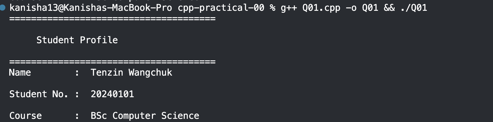
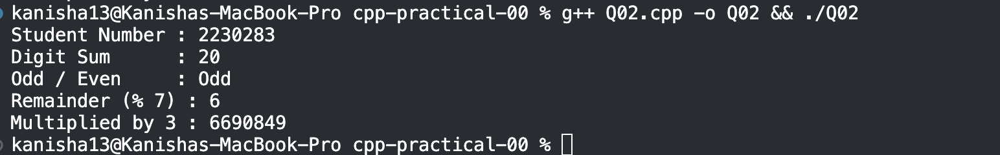
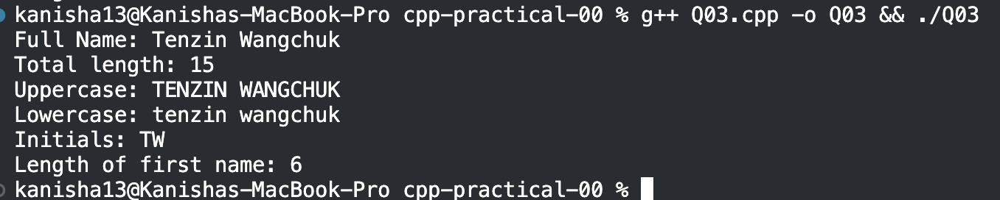
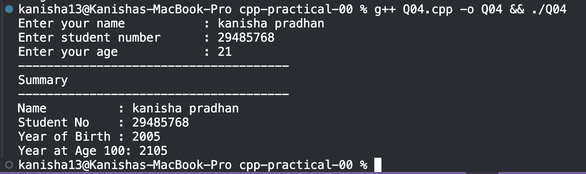
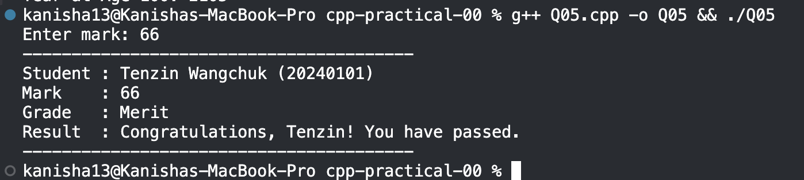
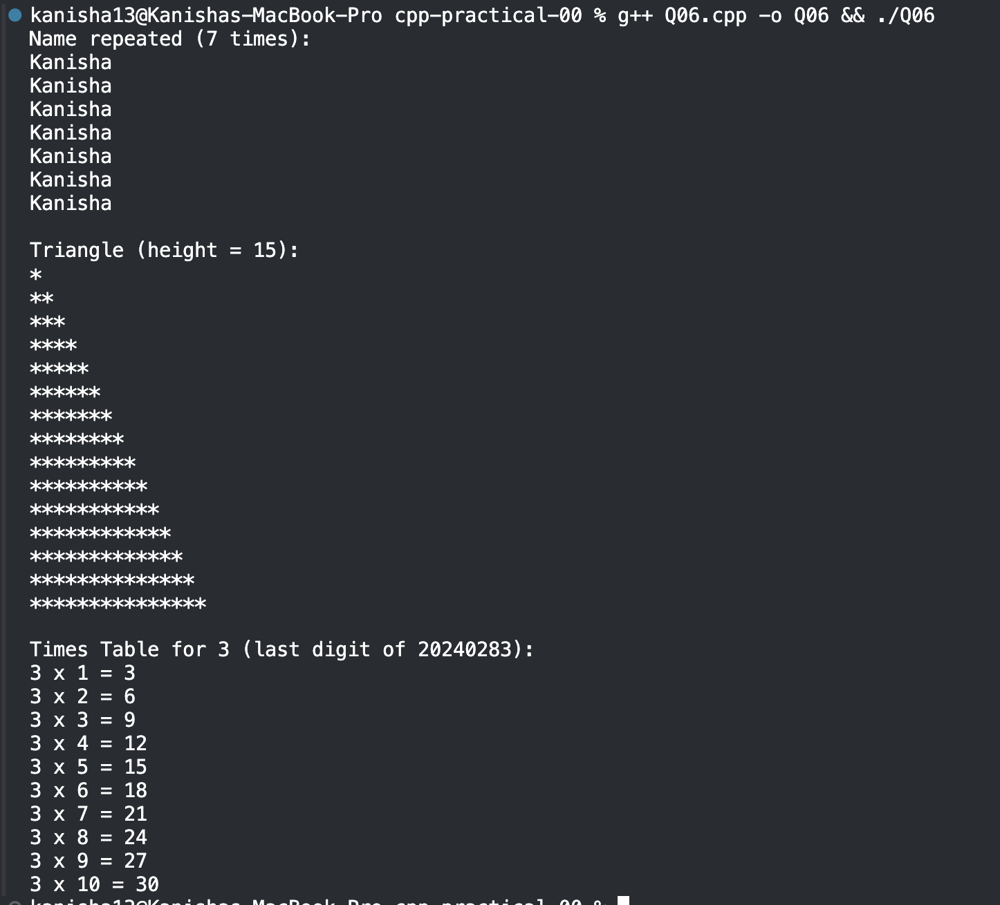
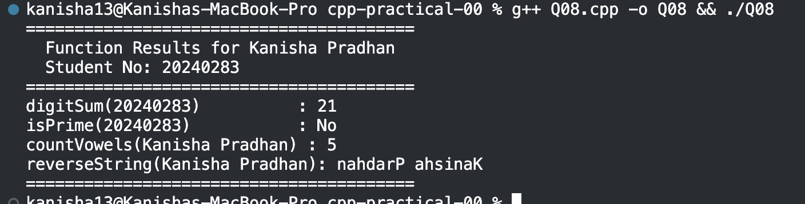
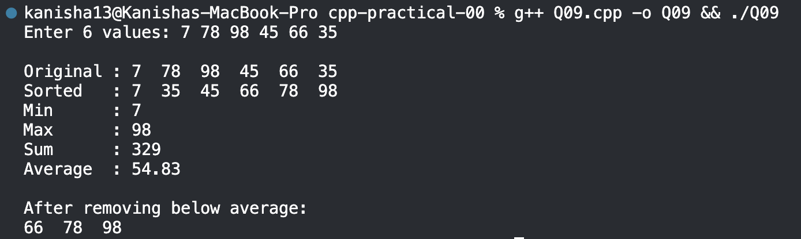
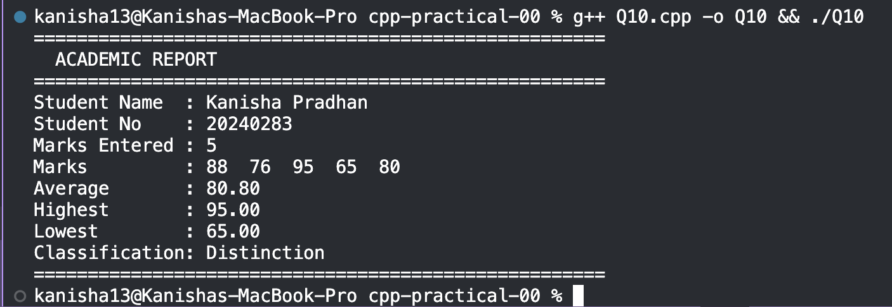

Q01 – Personal Introduction Output
Declares name and student number variables and prints a formatted student profile using cout.
g++ Q01.cpp -o Q01 && ./Q01

Q02 – Arithmetic with Student Number
Computes digit sum, odd/even check, remainder by 7, and multiplication using a hardcoded student number.
g++ Q02.cpp -o Q02 && ./Q02

Q03 – String Manipulation & Analysis
Performs string operations: length, uppercase/lowercase conversion, initials extraction, and first name length.
g++ Q03.cpp -o Q03 && ./Q03

Q04 – User Input & Type Conversion
Takes user input for name, student number, and age, then calculates birth year and year at age 100.
g++ Q04.cpp -o Q04 && ./Q04

Q05 – Conditional Grade Classification
Classifies a user-entered mark into Distinction, Merit, Pass, or Fail using if-else, with input validation.
g++ Q05.cpp -o Q05 && ./Q05

Q06 – Loop-Based Pattern Generation
Uses loops to print the first name N times, draw an asterisk triangle, and display a multiplication table.
g++ Q06.cpp -o Q06 && ./Q06

Q07 – Array Operations & Statistics
Stores 5 hardcoded marks in an array and computes highest, lowest, average, above-average count, and a bar chart.
g++ Q07.cpp -o Q07 && ./Q07

Q08 – Function Design & Modular Programming
Implements four functions: digit sum, prime check, vowel counter, and string reversal, called with hardcoded values.
g++ Q08.cpp -o Q08 && ./Q08

Q09 – Vector & Dynamic Collections
Uses STL vector to store 6 user-entered integers, sorts them, finds min/max/sum, and removes below-average values.
g++ Q09.cpp -o Q09 && ./Q09

Q10 – Classes & Object-Oriented Design
Implements a Student class with encapsulated attributes and methods to add marks and print a full academic report.
g++ Q10.cpp -o Q10 && ./Q10

